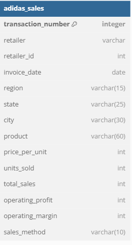
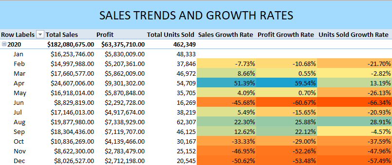
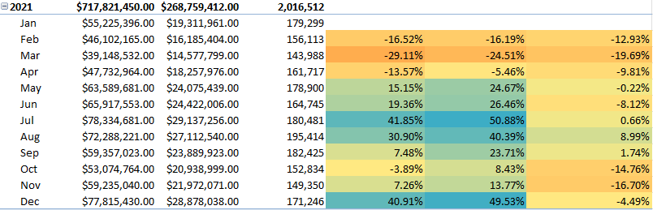
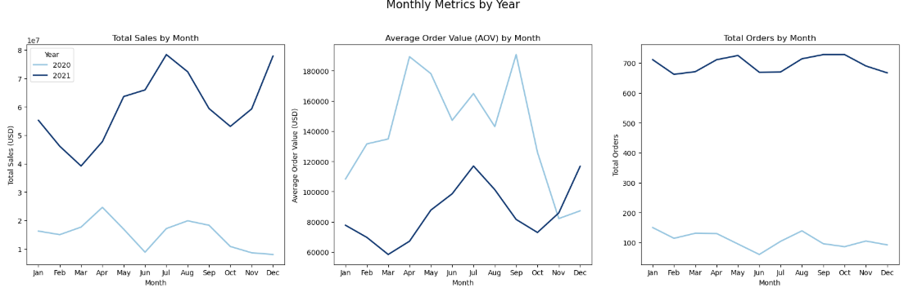
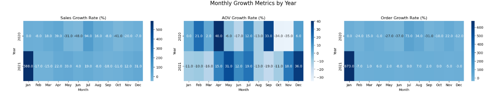

# Adidas-Pandemic-Sales-Analysis

Table of Contents

 - Project Overview
 - Executive Summary
 - Delving Into Insights
   - Sales Trends and Growth Rates
   - Regional Classification
   - Regional Performance
   - Product Effectiveness Metrics
   - Sales Methods and Retailers
 - Recommendations
 - Limitations and Assumptions
----
## Project Overview
Adidas, the renowned German sportswear giant recognized worldwide by its iconic 'Three Stripes' logo, partners with various retailers across the United States to expand its reach and drive profitability. However, the onset of COVID-19 in 2020 drastically reshaped the retail landscape. Mandated lockdowns and social distancing measures led to significant disruptions, forcing many businesses to adapt to sudden changes—or face financial losses and potential closure.

This project aims to analyze the impact—both positive and negative—of the pandemic's first two years on Adidas' retail sales. By collaborating with the sales and marketing teams, I will partner with the head of sales and marketing to extract valuable insights and provide actionable recommendations to enhance marketing efforts and drive sales growth in a post-pandemic world.

## Excecutive Summary
This analysis examines nearly 10,000 sales records from January 1, 2020, to December 31, 2021, revealing total revenue of approximately $900 million. Men's Street Footwear emerged as the leading product category, contributing 23.21% of total revenue. A significant shift toward e-commerce was observed, with online sales accounting for 50.7% of total revenue, surpassing in-store sales, which represented 49.3%.

To capitalize on these findings, Adidas should prioritize investments in online platforms, such as websites and mobile apps, to better serve customers who cannot access brick-and-mortar stores. Additionally, focusing on high-performing categories like Men's Street Footwear while reevaluating underperforming products can drive sustainable growth and strengthen market presence in the post-pandemic era.

Adidas Sale Dataset ERD

## Delving Into Insights
### Sales Trends and Growth Rates

 - Adidas generated nearly $900M in revenue from 01/01/2020 to 12/31/2021, with 9,648 recorded invoices.
 - Sales increased exponentially during 2021 by 294%, rising from $182.1M to $717.8M.
 - 2020 saw peak sales in April, correlating with the rise of online sales due to nationwide lockdown protocols. With more relaxed restrictions, 2021 saw peak sales in summer months(June-August) and December, indicating seasonality worth looking further into.
 - June 2021-August 2021 and December 2021 combined for $294.4M in revenue, making up an astounding 33% of total revenue generated. 
 - June 2020, November 2020 and December 2020 were the worst performing months, with sales growth and profit growth rates hovering around -50%.
   

### Regional Classification
Each state was classified into a region, with there being 5 regions in total. Below is each region and which states are present:
 - **West**: Washington, Oregon, California, Alaska, Hawaii, Idaho, Montana, Nevada, Utah, Wyoming, Colorado
 - **Southwest**: Arizona, New Mexico, Oklahoma, Texas
 - **Midwest**: North Dakota, South Dakota, Nebraska, Kansas, Missouri, Iowa, Minnesota, Wisconsin, Illinois, Indiana, Michigan, Ohio
 - **Northeast**: Maryland, Delaware, Pennsylvania, New Jersey, New York, Connecticut, Rhode Island, Massachusetts, Vermont, New Hampshire, Maine
 - **Southeast**: Virginia, West Virginia, Tennessee, Kentucky, Arkansas, Louisiana, Mississippi, Alabama, Florida, North Carolina, South Carolina, Georgia

### Regional Trends
 - The Southeast region slightly edged out the West region as best performing, accounting for 29% of total revenue. West accounted for 28% of the total revenue.
 - Understandibly, the Southwest region was the least performing region, due to only having four states present. With such a small area, this region can be zeroed in on to allocate targeted marketing strategies towards areas of more dense populations, such as Texas and Arizona.
 - The Southeast region is the only one to cross the $1M profit threshold from 2020-2021. Florida is a key state in this region as the most populated, which can help drive sales if consumer engagement is high.

   

