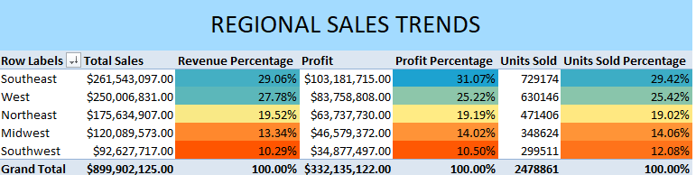
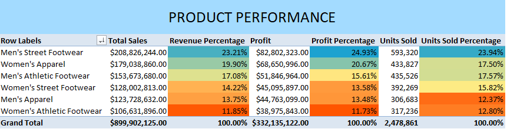
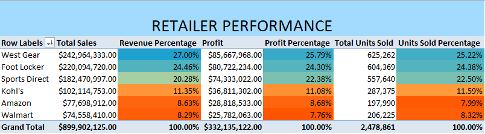
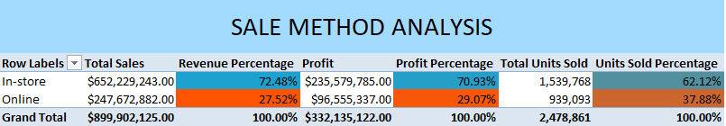

# Adidas-Pandemic-Sales-Analysis

Table of Contents

 - Project Overview
 - Executive Summary
 - Delving Into Insights
   - Sales Trends and Growth Rates
   - Regional Classification
   - Regional Performance
   - Product Effectiveness Metrics
   - Sales Methods and Retailers
 - Recommendations
 - Limitations and Assumptions
----
## Project Overview
Adidas, the renowned German sportswear giant recognized worldwide by its iconic 'Three Stripes' logo, partners with various retailers across the United States to expand its reach and drive profitability. However, the onset of COVID-19 in 2020 drastically reshaped the retail landscape. Mandated lockdowns and social distancing measures led to significant disruptions, forcing many businesses to adapt to sudden changes—or face financial losses and potential closure.

This project aims to analyze the impact—both positive and negative—of the pandemic's first two years on Adidas' retail sales. By collaborating with the sales and marketing teams, I will partner with the head of sales and marketing to extract valuable insights and provide actionable recommendations to enhance marketing efforts and drive sales growth in a post-pandemic world.

## Excecutive Summary
This analysis examines nearly 10,000 sales records from January 1, 2020, to December 31, 2021, revealing total revenue of approximately $900 million. Men's Street Footwear emerged as the leading product category, contributing 23.21% of total revenue. A significant shift toward e-commerce was observed, with online sales accounting for 50.7% of total revenue, surpassing in-store sales, which represented 49.3%.

To capitalize on these findings, Adidas should prioritize investments in online platforms, such as websites and mobile apps, to better serve customers who cannot access brick-and-mortar stores. Additionally, focusing on high-performing categories like Men's Street Footwear while reevaluating underperforming products can drive sustainable growth and strengthen market presence in the post-pandemic era.

Adidas Sale Dataset ERD

## Delving Into Insights
### Sales Trends and Growth Rates

 - Adidas generated nearly $900M in revenue from 01/01/2020 to 12/31/2021, with 9,648 recorded invoices.
 - Sales increased exponentially during 2021 by 294%, rising from $182.1M to $717.8M.
 - 2020 saw peak sales in April, correlating with the rise of online sales due to nationwide lockdown protocols. With more relaxed restrictions, 2021 saw peak sales in summer months(June-August) and December, indicating seasonality worth looking further into.
 - June 2021-August 2021 and December 2021 combined for $294.4M in revenue, making up an astounding 33% of total revenue generated. 
 - June 2020, November 2020 and December 2020 were the worst performing months, with sales growth and profit growth rates hovering around -50%.
   

## Regional Classification
Each state was classified into a region, with there being 5 regions in total. Below is each region and which states are present:
 - **West**: Washington, Oregon, California, Alaska, Hawaii, Idaho, Montana, Nevada, Utah, Wyoming, Colorado
 - **Southwest**: Arizona, New Mexico, Oklahoma, Texas
 - **Midwest**: North Dakota, South Dakota, Nebraska, Kansas, Missouri, Iowa, Minnesota, Wisconsin, Illinois, Indiana, Michigan, Ohio
 - **Northeast**: Maryland, Delaware, Pennsylvania, New Jersey, New York, Connecticut, Rhode Island, Massachusetts, Vermont, New Hampshire, Maine
 - **Southeast**: Virginia, West Virginia, Tennessee, Kentucky, Arkansas, Louisiana, Mississippi, Alabama, Florida, North Carolina, South Carolina, Georgia

## Regional Performance
 - The Southeast region slightly edged out the West region as best performing, accounting for 29% of total revenue. West accounted for 28% of the total revenue.
 - Understandibly, the Southwest region was the least performing region, due to only having four states present. With such a small area, this region can be zeroed in on to allocate targeted marketing strategies towards areas of more dense populations, such as Texas and Arizona.
 - The Southeast region is the only one to cross the $1M profit threshold from 2020-2021. Florida is a key state in this region as the most populated, which can help drive sales if consumer engagement is high.

## Product Effectiveness Metrics
 - Men's Street Footwear is the most popular product category in 2020 and 2021, accounting for around $208M(23% of total revenue) of the total revenue generated. Women's Apparel is second with $179M(about 20% of total revenue) of the total revenue generated.
 - Men's products generated $486M(54% of total revenue), compared to $413M(46% of total revenue) from Women's products.
 - Women's Athletic Footwear was the bottom performing product category, bringing in around $106M(12% of revenue). Yet it sold more than 11K total units than Men's Apparel, which accrued around $17M more in revenue. Reasons behind this could include a lower price per unit cost, or markups on products to mirror competitor pricing.

## Sales Methods and Retailers
 - West Gear leads with 27% of the total sales ($242.9M), making it the top performer in sales volume. Foot Locker is close behind with 24.5% ($220.1M), and Sports Direct follows with 20.3% ($182.5M).
 - Amazon and Walmart contribute the least, with 8.6% ($77.7M) and 8.3% ($74.6M) of total sales, respectively.
 - West Gear maintains the highest profit contribution, with 25.8% of the total profit ($85.7M), although its sales percentage (27%) is slightly higher than its profit percentage.
 - Sports Direct has a higher profit percentage (22.4%) relative to its sales percentage (20.3%), indicating better profitability on each sale.
 - West Gear has $136.5 in profit per unit sold ($85,667,968 / 625,262), making it the most efficient in terms of profitability per unit.
 - West Gear also leads in units sold, contributing 25.2% of the total units (625K). Foot Locker follows closely with 24.4% (604K).

 - In-store sales account for 72.5% of the total sales ($652.2M), significantly outpacing online sales, which contribute 27.5% ($247.7M). Despite the larger portion of sales coming from in-store, online sales still represent a significant share of the overall sales at nearly 28%.
 - In-store operations contribute 70.9% of total profits ($235.6M), reflecting its dominance in overall sales. Online sales contribute a higher proportion of profits (29.1% or $96.6M) compared to its share of total sales (27.5%). This indicates that online sales are more profitable on a per-dollar basis.
 - In-store sales account for 62.1% of the total units sold (1.5M), while online sales make up 37.9% (939K). Despite a larger share in total sales, in-store sales have a lower share of total units sold, meaning in-store purchases may involve higher-ticket items on average.
 - Online Sales show a higher profit-per-unit ratio. The profit per unit sold online is approximately $102.7 ($96,555,337 / 939,093 units), which is higher than the profit-per-unit for in-store sales, which is around $153.7 ($235,579,785 / 1,539,768 units). This suggests that while online sales are more profitable per unit sold, in-store sales bring in a higher total profit due to the volume of purchases.

## Recommendations
   

   

